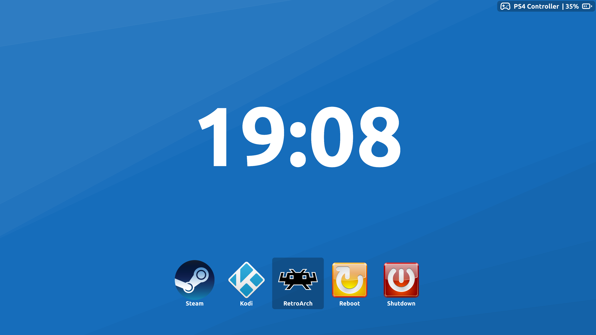

# GamePad Controlled Launcher

This is a simple application launcher designed to be an initial screen for my home media center.
It respects gamepad inputs and displays a list of connected gamepads,
a clock and a row of applications to run.



[Lucide icons](https://lucide.dev/) are used for gamepad status indication.

The launcher converts gamepad inputs into keyboard ones.

| Gamepad Button(s)    | Keyboard Key(s) | Action                       |
|----------------------|-----------------|------------------------------|
| DPad Buttons         | Arrow Keys      | Move the focus indicator     |
| Bottom Action Button | Enter           | Run the selected application |
| Up Action Button     | F5              | Reload configuration         |


## Configuration

The config file should be located at `$XDG_CONFIG_HOME/gcpl.toml`.
You can configure window layout and define application list. 

Example config:
```toml
[layout]
top_panel_height = 80 # default: 32
clock_height = 540 # default: 270
icon_size = 256 # default: 128

[[items]]
name = "Steam"
icon = "/usr/share/icons/hicolor/256x256/apps/steam.png"
exec = "steam -gamepadui"

[[items]]
name = "Kodi"
icon = "/usr/share/icons/hicolor/256x256/apps/kodi.png"
exec = "kodi"

[[items]]
name = "RetroArch"
icon = "/usr/share/pixmaps/retroarch.svg"
exec = "retroarch"

[[items]]
name = "Reboot"
icon = "/home/user/.local/share/pixmaps/reboot.png"
exec = "dbus-send --system --print-reply --dest=org.freedesktop.login1 /org/freedesktop/login1 org.freedesktop.login1.Manager.Reboot boolean:true"

[[items]]
name = "Shutdown"
icon = "/home/user/.local/share/pixmaps/shutdown.png"
exec = "dbus-send --system --print-reply --dest=org.freedesktop.login1 /org/freedesktop/login1 org.freedesktop.login1.Manager.PowerOff boolean:true"
```

The layout configuration itself and layout parameters are optional.
Note that layout parameters are defined in _logical_ pixels.

## Build

The launcher is written in Rust, so it is built with `cargo`.

It uses `Slint` as a graphical toolkit and uses `winit` as a backend
(required for checking window focus).

Now project is configured to work only in wayland environment,
but it can be easily changed for X11 support.
For details see the [slint feature list](https://docs.rs/slint/1.1.1/slint/#feature-flags).